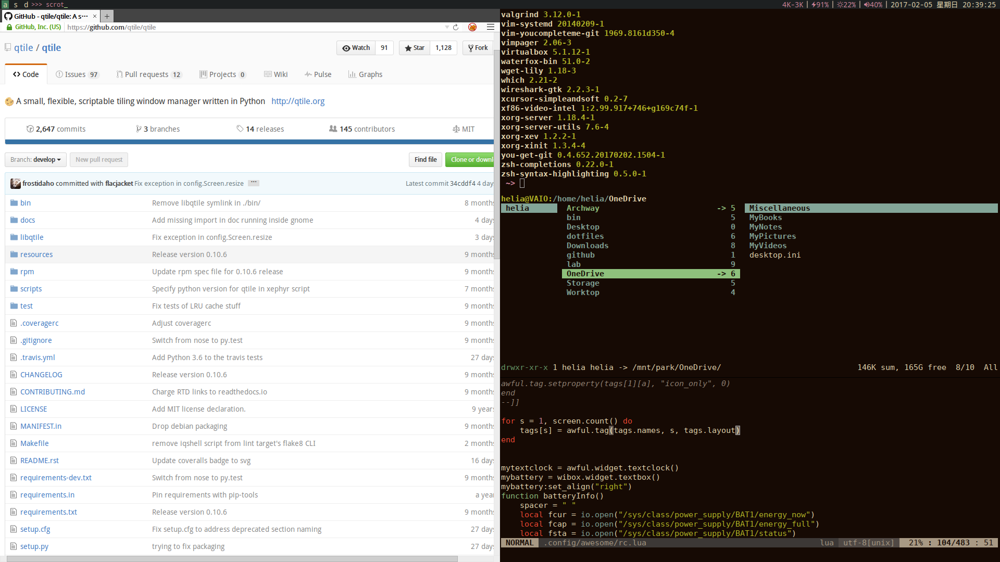

==========
Qtile 配置
==========

特性
====

* vim键绑定,全键盘操作
* column布局无缝与有缝切换(Mod4 + Space)
* 3个窗口组+1个隐藏窗口组(快捷键分别对应a, s, d, f)
* 左部为group和prompt; 右部为网速, 电量, 亮度, 音量, 时间
* 配色方案参考 `gruvbox <https://github.com/morhetz/gruvbox>`_

字体依赖
========

:首要字体: `Droid Sans Mono <https://fonts.google.com/specimen/Droid+Sans+Mono>`_
:图标字体: `ionicons <http://ionicons.com>`_

Arch Linux 用户::

  sudo pacman -S ttf-droid ttf-ionicons

快捷键
======

Tips: Mod4预设为Win键

======================  =====================
键组合                  功能
======================  =====================
Mod4 + Shift + q 	退出Qtile
Mod4 + Shift + r        重启Qtile
Mod4 + Enter            打开终端
Mod4 + r                执行程序或命令
mod4 + a, (s, d, f)     切换窗口组
Mod4 + j                焦点下移
Mod4 + k                焦点上移
Mod4 + h                焦点左移
Mod4 + l                焦点右移
Mod4 + Control + j      窗口下移
Mod4 + Control + k      窗口上移
Mod4 + Control + h      窗口左移
Mod4 + Control + l      窗口右移
Mod4 + Shift + j        窗口尺寸向下增长
Mod4 + Shift + k        窗口尺寸向上增长
Mod4 + Shift + h        窗口尺寸向左增长
Mod4 + Shift + l        窗口尺寸向右增长
Mod4 + n                窗口尺寸复原
Mod4 + x                关闭窗口
Mod4 + Space            切换布局
mod4 + z                切换焦点窗口浮动状态
mod4 + q                切换窗口全屏状态
mod4 + Tab              切换窗口Stack分割模式
======================  =====================

===================  ==================
鼠标                 功能
===================  ==================
Mod4 + 鼠标左键拖动  移动窗口并设为浮动
Mod4 + 鼠标右键拖动  调整窗口尺寸
Mod4 + 鼠标中键      切换窗口浮动
===================  ==================
